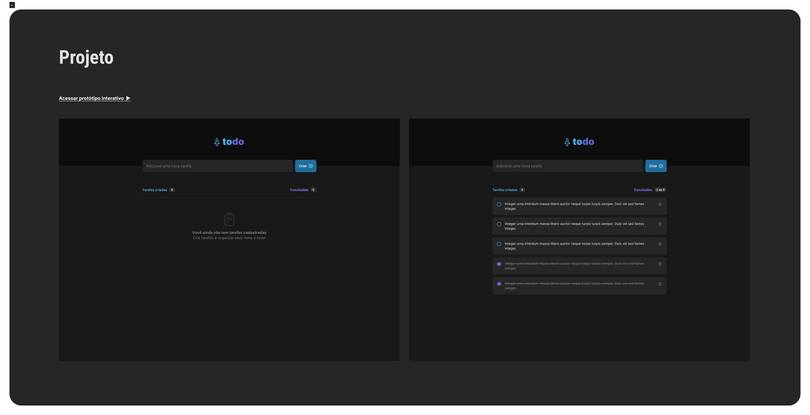

<p align="center">
  
</p>

<div align="center">
  <a></a>
  <a href="https://app.codacy.com/gh/EdTonatto/ROCKETSEAT-Ignite-ReactJS-Projeto-1/dashboard?utm_source=gh&utm_medium=referral&utm_content=&utm_campaign=Badge_grad"></a>
  <a href="https://github.com/EdTonatto/ROCKETSEAT-Ignite-ReactJS-Projeto-1/actions/workflows/main.yml"></a>
  <a href="https://github.com/EdTonatto/ROCKETSEAT-Ignite-ReactJS-Projeto-1/blob/main/LICENSE"></a>
</div>

# ToDO

**ToDO** is a project of a to-do list web page presented by [Rocketseat](https://www.rocketseat.com.br/)'s course of ReactJS as a [challenge](https://efficient-sloth-d85.notion.site/Desafio-01-Praticando-os-conceitos-do-ReactJS-91fd63dd1a5b4a2796152de293ec1074#216494e51e124dababb1a011c31986de) to the first chapter. It uses ReactJS with Typescript Vite as a build tool.

Between the features of **ToDO** are: 
  - Adding a new task.
  - Remove a task from the list.
  - Check/Uncheck a task as done.
  - Show tasks conclusion progress.

Some of the ReactJS concepts applied to build this project are:
  - States
  - Immutability
  - Lists and keys on ReactJS
  - Properties
  - Components

## Preview

<p align="center"></p>

## Usage

To install dependencies, run:

```bash
npm install
```

To create a production build, run:

```bash
npm run build
```

To deploy to Github pages, run:

```bash
npm run deploy
```

To run in dev environment, run: 

```bash
npm run dev
```

## Dependencies
  - react-icons: ^4.10.1
  - react: ^18.2.0
  - react-dom: ^18.2.0

## License

This project is licensed under the [MIT License](https://opensource.org/licenses/MIT).
